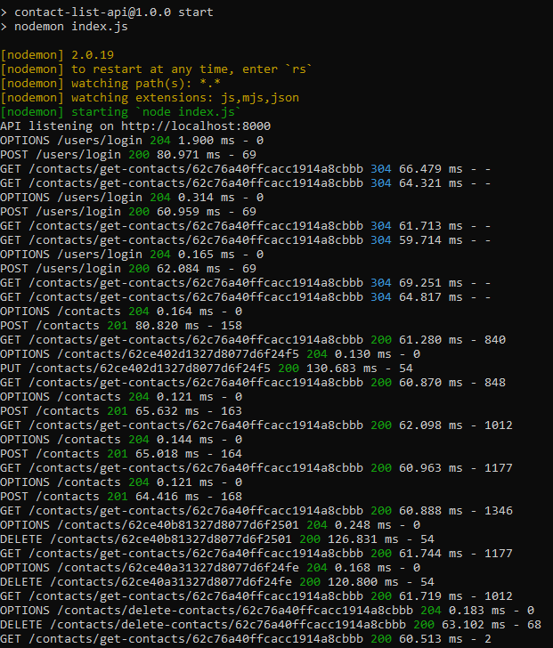

# Contact list API

## Sobre el API

Esta API fue creada para servir un [SPA](https://github.com/Ricaidito/contact-list-client) con capacidades para manejar una agenda de contactos y usuarios.

Las tecnologías y dependencias utilizadas fueron:

- Node
- Express
- MongoDB
- dotenv
- body-parser
- Morgan
- CORS

Nodemon también es utilizado para el hot-reload.

## Como ejecutar el servidor

Para ejecutar el servidor basta con abrir una terminal en la raíz del proyecto y ejecutar el siguiente comando para instalar las dependencias.

`npm install`

Una vez descargadas las dependencias asegúrese de tener el correspondiente archivo `.env` con las variables de entorno para la conexión a la base de datos.

Por último ejecute el siguiente comando para iniciar el servidor.

`npm start`

Por defecto el servidor escucha a las peticiones en `http://localhost:8000/` a menos que se le especifique otro puerto.

## Endpoints

### Users

```js
_id: ObjectId;
email: String;
password: String;
```

**- Crear una cuenta**

`POST /users`

**- Hacer login**

`POST /users/login`

### Contacts

```js
_id: ObjectId;
userId: ObjectId;
firstName: String;
lastName: String;
email: String;
phoneNumber: String;
```

**- Fetch de todos los contactos**

`GET /contacts`

**- Fetch de un contacto por id**

`GET /contacts/{id}`

**- Fetch de todos los contactos de un usuario**

`GET /contacts/get-contacts/{userId}`

**- Crear un contacto**

`POST /contacts`

**- Actualizar un contacto**

`PUT /contacts/{id}`

**- Eliminar un contacto**

`DELETE /contacts/{id}`

**- Eliminar todos los contactos de un usuario**

`DELETE /contacts/delete-contacts/{userId}`

## Preview

### API


